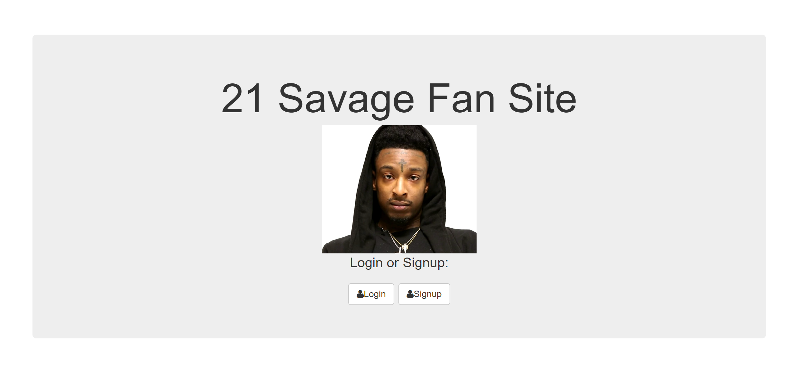

# Full Stack Authorization Web Application

### Goal: Create a web application that allowed users to signup and login. Once user is logged in, tney have the ability to submit messages on the profile page, in which they can either upvote, downvote, or delete messages. The files are served up from a MongoDB database. 

*Project completed using HTML, CSS, Javascript, Node.js, Express.js, and MongoDB. (Project inspired by Grammy-Award winning artist 21 Savage)*

## Installation

1. Clone repo
2. run `npm install`

## Usage

1. run `node server.js`
2. Navigate to `localhost:8080`

## Credit

Modified from Scotch.io's auth tutorial
